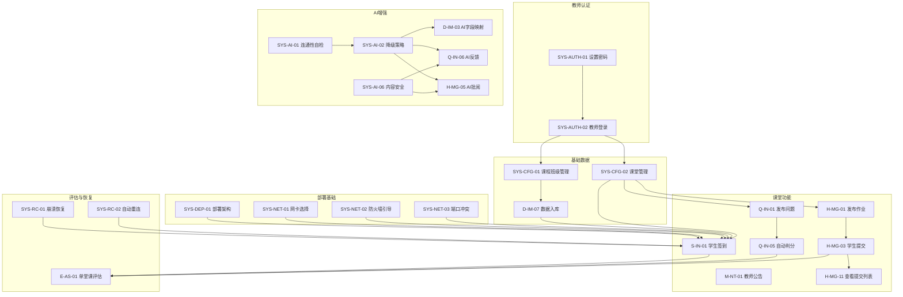

# 大学教学过程辅助软件需求分析报告（V2.0）

---

## 一、文档信息

| 项目 | 内容 |
|------|------|
| 产品名称 | 大学教学过程辅助软件 |
| 产品形态 | B/S 架构局域网教学辅助系统 |
| 使用场景 | 高校机房课堂教学 |
| 使用对象 | 教师、学生（系统管理员由教师兼任） |
| 部署环境 | 机房局域网，后端运行于教师机，学生端通过浏览器访问 |
| 文档版本 | V2.0 |
| 编写目的 | 基于 V1.0 评审反馈全面修订需求，明确变更内容、完善需求描述、建立可追溯性，为后续设计与开发提供依据 |
| 修订日期 | 2025-07-05 |

### 版本历史

| 版本 | 日期 | 修订人 | 修订内容 |
|------|------|--------|----------|
| V1.0 | 2025-07-04 | 慧行 | 初始版本，完成产品需求说明书初稿 |
| V2.0 | 2025-07-05 | 许清楚（产品经理） | 基于四维度评审报告（28 个问题点）全面修订，解决 13 项必须修订 + 15 项建议修订，新增系统管理与部署模块，补充课堂状态机、加分规则默认值、崩溃恢复流程、AI 内容安全、AI 分级降级策略等 |

---

## 二、变更摘要

| 变更类型 | 数量 | 说明 |
|----------|------|------|
| 新增需求 | 18 项 | 含新增模块（系统管理与部署）、新增功能需求（教师登录、学生停用、AI 内容安全、网卡选择、防火墙引导、备份恢复、崩溃恢复等） |
| 修改需求 | 22 项 | 含登录校验统一、加分规则明确化、课堂状态机补充、消息类型合并、作业状态拆分、评估指标调整、数据模型补字段等 |
| 删除/排除需求 | 3 项 | 编程题排除出一期范围、敏感内容过滤降为 P2、删除"统一身份信息"概念 |

### 变更统计

- **🔴 必须修订项覆盖**：13/13 项全部解决
- **🟡 建议修订项覆盖**：15/15 项全部处理
- **评审编号覆盖**：1.1~1.8、B1~B3、3.1.1~3.3.4、4.1.1~4.3.1 全部 28 个问题点均有对应变更

---

## 三、变更详情表

> 每行对应一个评审问题点，标注变更类型、变更内容、变更原因及对应评审编号。

### 3.1 🔴 必须修订项（13 项）

| 序号 | 变更类型 | 变更内容 | 变更原因 | 对应评审编号 |
|------|----------|----------|----------|-------------|
| 1 | 修改 | S-IN-01 登录校验统一为"学号+姓名"双因子校验，删除"或"和"统一身份信息"概念 | V1.0 中 S-IN-01 与 11.3 安全需求矛盾，"统一身份信息"在 U 盘局域网环境下无对接基础 | 1.1 |
| 2 | 修改 | Q-IN-07 加分规则从"示例"改为明确默认配置表：参与分 1 分/题、正确分 2 分/题、时效分 0.5 分/题（前 30% 提交者）、质量分 0-3 分、单堂课上限 20 分 | V1.0 加分规则全为"示例"无具体数值，验收不可测 | 1.3 |
| 3 | 新增 | 新增课堂状态机：待开始 → 进行中 → 已结束，教师手动结束或到 end_time 自动结束；课堂结束触发缺勤标记和学习效果评估初始化 | V1.0 全文未定义"课堂结束"状态转换，缺勤判定和评估触发无依据 | 1.7 |
| 4 | 修改 | 部署架构明确为"程序在 U 盘、数据库运行在教师机本地磁盘、课后自动备份到 U 盘"；非功能需求补充数据库运行位置 | V1.0 未明确数据库运行位置，U 盘直接运行数据库存在性能瓶颈和损坏风险 | B1 |
| 5 | 新增 | 新增 SYS-NET-01 网卡选择 UI、SYS-NET-02 防火墙引导、SYS-NET-03 端口冲突自动切换需求 | V1.0 自动检测 IP 可能选错网卡，防火墙拦截和端口冲突无处理 | B2 |
| 6 | 新增 | 新增"立项前外网验证"前置条件 + AI 分级降级策略明确化（4 个场景分别定义降级方案）+ 启动时 AI 连通性自检 | V1.0 未验证机房外网访问能力，AI 全部依赖外网但无降级保障 | B3 |
| 7 | 新增 | 新增 D-IM-10 学生停用功能（非物理删除），学生表增加 is_active 字段 | V1.0 只有新增和更新，学期中学生转班/退课/休学无处理 | 3.1.1 |
| 8 | 修改 | 课程表增加 teacher_id 字段，课堂表增加 class_id 和 session_no 字段；课前流程明确"选课程→选班级→创建/选课堂" | V1.0 课程表无 teacher_id 关联，课堂表无 class_id，无法支持多课程多班级 | 3.1.3 |
| 9 | 新增 | 新增 SYS-RC-01~SYS-RC-04 崩溃恢复流程：重启自动读取课堂状态快照恢复、学生端心跳检测+自动重连、断线期间本地缓存重发、中断时间段教师可选处理 | V1.0 提到"重启后可恢复"但缺少状态同步、断线处理、中断时段处理等定义 | 3.3.1 |
| 10 | 新增 | 新增 SYS-AI-06 AI 反馈内容安全检查需求：关键词/敏感词过滤 + 最大长度限制 + 可配置"先经教师审核"或"直接展示但有举报按钮" | V1.0 仅依赖 AI 服务端审核，应用层对 AI 返回有害内容无拦截 | 3.3.3 |
| 11 | 修改 | P0 新增"教师查看作业提交列表"（H-MG-11），AI 批阅和教师复核保持 P1 | V1.0 P0 有发布+提交但无教师查看，作业功能不闭环 | 4.1.1 |
| 12 | 修改 | P0 新增"教师发布课堂公告/通知"（M-NT-01 教师部分 + M-NT-02 查看） | V1.0 P0 无教师公告，课堂流程运转不畅 | 4.1.2 |
| 13 | 删除/排除 | 编程题明确排除出一期范围（标注为远期 P2+），一期题型限定为单选/多选/判断/填空/简答 | V1.0 编程题混在课堂问答中标注"可扩展"，隐含大量未拆分子任务 | 4.2.1 |

### 3.2 🟡 建议修订项（15 项）

| 序号 | 变更类型 | 变更内容 | 变更原因 | 对应评审编号 |
|------|----------|----------|----------|-------------|
| 14 | 修改 | 消息类型合并为单一"课堂公告"类型（通过发送者角色区分来源），权限矩阵明确教师/学生公告权限分别列出 | V1.0"课堂公告"与"教师通知"概念重叠，边界不清 | 1.2 |
| 15 | 修改 | 评估指标调整：合并"课堂互动参与"和"答题正确率/质量"为"课堂问答表现"（权重 35%），释放权重给其他维度；新增"课堂消息参与"维度（权重 10%） | V1.0 两项指标数据源重叠，50% 权重集中问答模块，区分度不足 | 1.4 |
| 16 | 修改 | 作业状态拆分为两个字段：作业状态（未开放/进行中/已截止/已归档）+ 学生提交状态（未提交/已提交/迟交/待批阅/AI 已批阅/教师已复核/已发布） | V1.0 作业级别状态与学生提交级别状态混用，无法用单字段表达 | 1.5 |
| 17 | 修改 | 学生表补充 gender、phone、email 字段，标注为"可选扩展字段，一期不强制入库" | V1.0 标准字段定义了三字段但数据模型缺失 | 1.6 |
| 18 | 修改 | 答案表和作业提交表增加 submit_version + is_latest 字段，每次提交新增记录保留完整历史 | V1.0 定义了"修改答案"行为但数据表无版本管理字段 | 1.8 |
| 19 | 修改 | 课堂表增加 session_no（课次序号）字段；支持课堂时间修改（调课）；支持新增补课课堂并标记类型；课前流程增加"选择已有课堂或创建新课堂"分支 | V1.0 无课次序号字段，无调课/补课流程定义 | 3.1.2 |
| 20 | 新增 | 新增 SYS-AUTH-01~SYS-AUTH-04 教师登录与密码管理：首次启动强制设置教师密码 + 教师端登录页 + 设置页修改密码 + 密码哈希存储 | V1.0 要求"教师端设置管理密码"但无登录流程、密码设置入口、修改/找回机制 | 3.1.4 |
| 21 | 修改 | 签到时间窗默认行为：未设置时默认签到开始时间=课堂开始时间，截止时间=课堂开始+15 分钟（可配置），超截止登录标记迟到 | V1.0 未定义教师忘记设置签到时间窗时的默认行为 | 3.2.1 |
| 22 | 修改 | H-MG-01 增加校验：截止时间必须晚于发布时间且晚于当前时间，过期则提示教师确认 | V1.0 未校验截止时间，教师可能误设过去时间 | 3.2.2 |
| 23 | 新增 | 新增 Q-IN-11 答题草稿恢复机制：草稿实时自动保存到后端，学生重登后自动恢复未提交草稿，题目已截止则草稿不可提交但可查看；答案表增加 is_draft 字段 | V1.0 定义了 save_draft 行为但草稿持久化和恢复机制未定义 | 3.3.2 |
| 24 | 修改 | 学习效果评估临时结果规则明确化：作业未截止时该维度标"未评估"，总分仅算已完成维度按比例折算；作业批阅完成自动重算更新；评估表增加 is_final 字段 | V1.0 临时结果作业维度如何计分、是否通知学生、版本管理均未定义 | 3.3.4 |
| 25 | 修改 | P0"答题记录与加分统计"拆分：P0 保留答题记录（行为痕迹、答案存储、客观题自动判分），加分统计降 P1（P1 阶段先明确加分规则配置表） | V1.0 P0 加分规则全是"示例"无具体数值，P0 阶段无法验收 | 4.1.3 |
| 26 | 修改 | 敏感内容过滤（M-NT-08）明确为 P2 远期版本，一期仅靠教师手动管理公告（删除、屏蔽） | V1.0 敏感内容过滤未明确优先级，涉及独立安全模块工作量 | 4.2.2 |
| 27 | 修改 | P1 评估展示为基础表格+简单统计图（柱状/饼图）；P2 大屏为课堂实时投屏（签到热力图、答题实时统计、班级雷达图），两者定位不同需区分 | V1.0 P2 大屏与 P1 报表边界不清 | 4.2.3 |
| 28 | 修改 | D-IM-03 AI 字段映射标注优先级 P1；导入流程标注"一期 P0 跳过 AI 步骤采用手动映射"；P0 的 D-IM-02 仅做表头读取展示不做智能映射 | V1.0 P0 有 Excel 导入、P1 有 AI 解析，但未明确 P0 是否调 AI | 4.3.1 |

---

## 四、需求概述

### 4.1 产品定位

本产品面向大学机房课堂教学场景，采用 B/S 架构部署于局域网中，以教师机作为后端服务运行节点，学生通过浏览器访问系统。产品核心围绕"课堂过程数据采集、互动行为记录、作业在线管理、AI 辅助反馈、学习效果评估"展开。

**关键架构原则（V2.0 修订）**：

1. **程序便携 + 数据本地**：程序和配置存放于 U 盘，数据库运行在教师机本地磁盘，课后自动备份到 U 盘（评审 B1）
2. **基础功能 100% 可用**：签到/答题/作业提交/成绩统计不依赖 AI，无外网时保证完整可用（评审 B3）
3. **AI 作为增强**：AI 能力可配置、可降级、可人工复核，不作为核心流程的必要环节（评审 B3）

### 4.2 用户角色

| 角色 | 说明 | 核心权限 |
|------|------|----------|
| 教师 | 课堂管理核心角色，可兼任系统管理员 | 启动课堂、导入学生、发布公告/问题/作业、查看签到/答题/提交、AI 批阅复核、调整成绩、查看评估、系统设置、备份恢复 |
| 学生 | 课堂参与角色，通过浏览器访问 | 登录签到、查看公告、答题、提交作业、查看反馈与个人表现、向教师发送私信 |

### 4.3 核心场景

| 场景 | 关键流程 |
|------|----------|
| 课前准备 | 教师插 U 盘启动系统 → 选择网卡与端口 → 登录教师端 → 选课程/班级 → 导入学生名单（P0 手动映射/P1 AI 辅助） → 创建课堂 → 展示访问地址 |
| 课堂签到 | 学生浏览器访问 → 输入学号+姓名登录 → 系统双因子校验 → 自动生成签到记录 → 教师端实时查看签到统计 |
| 课堂互动 | 教师发布问题 → 学生在线作答 → 系统记录行为痕迹 → 客观题自动判分 / 简答题 AI 反馈（可降级） → 教师查看统计 |
| 作业管理 | 教师发布作业 → 学生提交 → 教师查看提交列表（P0）/ AI 批阅+教师复核（P1） → 学生查看反馈 |
| 课堂结束 | 教师手动结束或到 end_time 自动结束 → 触发缺勤标记 → 触发学习效果评估 → 数据自动备份到 U 盘 |
| 异常恢复 | 教师机宕机 → 重启后自动读取课堂状态快照 → 学生端心跳检测自动重连 → 断线期间缓存请求批量重发 → 教师处理中断时段 |

---

## 五、功能需求清单

> 每条需求包含：编号、优先级、功能描述、验收标准（可测可验）、约束条件。
> 优先级定义：P0 = 一期必须实现（Must have）；P1 = 一期应该实现（Should have）；P2 = 一期可选/后续版本（Nice to have）。

---

### 5.1 学生签到系统

#### S-IN-01 学生登录签到

| 属性 | 内容 |
|------|------|
| 优先级 | P0 |
| 功能描述 | 学生访问课堂地址后，输入学号和姓名进行登录，系统校验学号与姓名是否同时匹配学生表记录，匹配成功后自动完成签到。**统一为"学号+姓名"双因子校验，删除"或"和"统一身份信息"概念。** |
| 验收标准 | 1) 当学生输入正确学号和正确姓名时，系统应在 2 秒内返回登录成功并生成签到记录；2) 当学生输入正确学号但错误姓名时，系统应返回"学号与姓名不匹配"提示，不生成签到记录；3) 当学生输入不存在学号时，系统应返回"学号不存在"提示；4) 当学号或姓名任一为空时，系统应阻止提交并提示必填。 |
| 约束条件 | 学号和姓名必须同时校验（双因子）；不使用密码登录；同一课堂同一学号仅允许一条有效签到记录；"统一身份信息"概念已删除。 |
| 变更追溯 | 评审 1.1（登录校验方式矛盾） |

#### S-IN-02 自动签到记录

| 属性 | 内容 |
|------|------|
| 优先级 | P0 |
| 功能描述 | 登录成功后系统自动记录签到时间、IP 地址、设备信息（User-Agent）。 |
| 验收标准 | 1) 当学生登录成功时，系统应在签到表中生成一条记录，包含 session_id、student_id、sign_time（精确到秒）、ip_address、device_info；2) 签到记录的 sign_time 应与学生实际登录时间一致（误差不超过 1 秒）。 |
| 约束条件 | device_info 仅记录 User-Agent 和 IP，不采集硬件指纹；多设备登录仅作提示不强制拦截。 |

#### S-IN-03 签到状态判断

| 属性 | 内容 |
|------|------|
| 优先级 | P0 |
| 功能描述 | 根据教师设置的签到时间窗口（开始时间和截止时间）判断签到状态为"正常"或"迟到"。**未设置签到时间窗时，默认签到开始时间=课堂开始时间，截止时间=课堂开始+15 分钟（可配置）。** |
| 验收标准 | 1) 当学生在签到截止时间之前登录时，签到状态应标记为"正常签到"；2) 当学生在签到截止时间之后、课堂结束之前登录时，签到状态应标记为"迟到"；3) 当教师未设置签到时间窗时，系统应使用默认值（开始=课堂开始时间，截止=课堂开始+15 分钟）自动判断；4) 教师可在设置页修改默认迟到阈值。 |
| 约束条件 | 签到时间窗可在创建课堂时设置或使用默认值；默认迟到阈值可配置。 |
| 变更追溯 | 评审 3.2.1（签到时间窗默认行为未定义） |

#### S-IN-04 防重复签到

| 属性 | 内容 |
|------|------|
| 优先级 | P0 |
| 功能描述 | 同一学生同一课堂仅生成一条有效签到记录，重复登录不重复计签到。 |
| 验收标准 | 1) 当同一学生第二次登录同一课堂时，系统应允许登录但不生成新的签到记录，签到时间保持首次登录时间；2) 签到表中 (session_id, student_id) 组合应具有唯一约束；3) 并发登录场景下，数据库唯一约束应防止重复插入。 |

#### S-IN-05 教师查看签到

| 属性 | 内容 |
|------|------|
| 优先级 | P0 |
| 功能描述 | 教师端实时查看已签到、未签到、迟到名单，签到人数实时更新。 |
| 验收标准 | 1) 当学生完成签到时，教师端签到页面应在 3 秒内更新已签到人数和名单；2) 教师端应能查看已签到（正常/迟到分类）、未签到学生列表；3) 签到统计数据应与签到表记录一致。 |

#### S-IN-06 签到数据导出

| 属性 | 内容 |
|------|------|
| 优先级 | P1 |
| 功能描述 | 支持导出签到数据为 Excel 或 CSV 格式。 |
| 验收标准 | 1) 当教师点击"导出签到数据"时，系统应生成包含学号、姓名、班级、签到时间、签到状态的 Excel/CSV 文件；2) 导出文件应包含所有学生（含未签到标记为缺勤）。 |

#### S-IN-07 异常处理与手动补签

| 属性 | 内容 |
|------|------|
| 优先级 | P1 |
| 功能描述 | 支持教师手动补签、修改签到状态（正常/迟到/缺勤/请假）。 |
| 验收标准 | 1) 当教师选择某未签到学生并点击"补签"时，系统应为该学生生成签到记录，签到时间默认为当前时间，状态由教师选择；2) 当教师修改某学生签到状态时，系统应更新记录并保留修改日志（修改人、修改时间、原状态、新状态）。 |

#### 课堂状态机（新增）

> 评审 1.7 要求补充课堂状态机定义。

| 状态 | 说明 | 触发条件 | 触发动作 |
|------|------|----------|----------|
| 待开始 | 课堂已创建但尚未开始 | 教师创建课堂 | 等待开始 |
| 进行中 | 课堂正在进行，学生可签到、答题、提交作业 | 教师手动点击"开始课堂" 或 到达 start_time | 开放签到、学生可登录 |
| 已结束 | 课堂已结束，学生不可再签到/答题 | 教师手动点击"结束课堂" 或 到达 end_time | ①标记未签到学生为缺勤；②触发学习效果评估初始化；③触发数据自动备份到 U 盘 |

**状态转换规则**：

| 当前状态 | 目标状态 | 触发方式 | 约束 |
|----------|----------|----------|------|
| 待开始 | 进行中 | 教师手动开始 / 到达 start_time 自动开始 | 必须已完成学生名单导入 |
| 进行中 | 已结束 | 教师手动结束 / 到达 end_time 自动结束 | 结束后不可逆；学习效果评估在作业未截止时生成临时结果（评审 3.3.4） |

**验收标准**：
1. 当教师创建课堂后未点击"开始课堂"且未到 start_time 时，课堂状态应显示为"待开始"，学生不可登录签到；
2. 当教师点击"开始课堂"或到达 start_time 时，课堂状态应变更为"进行中"，学生可登录签到；
3. 当教师点击"结束课堂"或到达 end_time 时，课堂状态应变更为"已结束"，系统应自动将未签到学生标记为缺勤，并触发学习效果评估初始化；
4. 课堂状态从"进行中"变为"已结束"后不可逆转，教师不可重新开启已结束的课堂。

**约束条件**：课堂表 status 字段枚举值为 `pending`（待开始）、`active`（进行中）、`ended`（已结束）。

**变更追溯**：评审 1.7（"课堂结束"状态转换未定义）

---

### 5.2 数据导入模块

#### D-IM-01 上传 Excel 文件

| 属性 | 内容 |
|------|------|
| 优先级 | P0 |
| 功能描述 | 支持上传 .xls、.xlsx 格式的学生名单 Excel 文件。 |
| 验收标准 | 1) 当教师上传 .xls 或 .xlsx 文件时，系统应成功接收并解析文件；2) 当教师上传非 Excel 格式文件时，系统应拒绝并提示"仅支持 .xls/.xlsx 格式"；3) 当文件超过 10MB 时，系统应提示文件过大。 |
| 约束条件 | 单文件大小限制 10MB。 |

#### D-IM-02 表头读取展示

| 属性 | 内容 |
|------|------|
| 优先级 | P0 |
| 功能描述 | 系统读取 Excel 表头与样例数据并展示给教师。**P0 阶段仅做表头读取展示，不做智能映射。** |
| 验收标准 | 1) 当 Excel 上传成功后，系统应在 3 秒内展示表头列名和前 5 行样例数据；2) 展示内容应包含原始列名和对应样例值。 |
| 约束条件 | P0 阶段仅读取展示，不调用 AI 进行智能映射。 |
| 变更追溯 | 评审 4.3.1（P0 Excel 导入与 AI 解析关系） |

#### D-IM-03 AI 字段映射

| 属性 | 内容 |
|------|------|
| 优先级 | P1 |
| 功能描述 | 调用大模型 API 识别 Excel 表头语义，将原始列名映射到标准字段（student_id、name、class_name 等）。**P1 功能，P0 阶段跳过此步骤采用手动映射。** |
| 验收标准 | 1) 当 AI 可用时，系统应将表头和前 5 行样例数据发送给大模型，返回字段映射建议；2) AI 返回的映射结果应展示为"原始列名 → 标准字段"对照表，教师可逐列确认或修改；3) 当 AI 不可用时，系统应自动降级为手动字段映射（下拉框选择标准字段），并提示"AI 不可用，请手动映射"。 |
| 约束条件 | 仅传表头+前 5 行样例数据控制 token 消耗；AI 不可用时降级为手动映射。 |
| 变更追溯 | 评审 4.3.1（P0 Excel 导入与 AI 解析关系） |

#### D-IM-04 人工确认映射

| 属性 | 内容 |
|------|------|
| 优先级 | P0 |
| 功能描述 | 教师可修改 AI 推断结果或手动设置字段映射关系。 |
| 验收标准 | 1) 当展示字段映射对照表时，教师应能通过下拉框修改每个原始列对应的标准字段；2) 教师可将原始列标记为"不导入"；3) student_id 和 name 必须映射，未映射时系统应阻止下一步。 |

#### D-IM-05 数据校验

| 属性 | 内容 |
|------|------|
| 优先级 | P0 |
| 功能描述 | 校验学号为空、重复、格式异常等问题。 |
| 验收标准 | 1) 当学号为空的行存在时，系统应在预览中标记并提示"第 X 行学号为空"；2) 当同一学号出现多次时，系统应提示重复学号及行号；3) 校验结果应区分"错误"（阻止导入）和"警告"（允许导入但提示）。 |

#### D-IM-06 导入预览

| 属性 | 内容 |
|------|------|
| 优先级 | P0 |
| 功能描述 | 导入前展示标准化数据预览，包含校验结果标注。 |
| 验收标准 | 1) 当教师确认映射后，系统应展示标准化数据预览表，包含标准字段名和数据行；2) 预览表中应标注校验异常的行（红色标记错误、黄色标记警告）；3) 教师可选择"仅导入有效数据"或"全部导入"。 |

#### D-IM-07 数据入库

| 属性 | 内容 |
|------|------|
| 优先级 | P0 |
| 功能描述 | 确认后写入学生表、班级表、课程关联表。 |
| 验收标准 | 1) 当教师点击"确认导入"后，系统应将标准化数据写入学生表，关联班级和课程；2) 导入完成后应显示成功导入 X 条、跳过 Y 条、失败 Z 条的统计；3) 导入的每一行应与课程和班级建立关联。 |

#### D-IM-08 错误报告

| 属性 | 内容 |
|------|------|
| 优先级 | P1 |
| 功能描述 | 导入失败时生成错误明细报告。 |
| 验收标准 | 1) 当导入过程中出现错误时，系统应生成错误明细报告，包含行号、学号、错误原因；2) 错误报告可导出为文件。 |

#### D-IM-09 增量导入

| 属性 | 内容 |
|------|------|
| 优先级 | P1 |
| 功能描述 | 支持新增学生、更新已有学生信息。同一学号重复导入时提示覆盖、跳过或合并。 |
| 验收标准 | 1) 当导入的学号已存在时，系统应提示"学号 XXX 已存在"，并提供"覆盖""跳过""合并"三个选项；2) 选择"覆盖"时更新学生信息；3) 选择"跳过"时保留原数据；4) 选择"合并"时仅更新非空字段。 |

#### D-IM-10 学生停用（新增）

| 属性 | 内容 |
|------|------|
| 优先级 | P1 |
| 功能描述 | 支持教师停用学生（非物理删除），停用学生不在当前课堂名单显示但保留历史数据。 |
| 验收标准 | 1) 当教师在学生管理页选择某学生并点击"停用"时，系统应将该学生 is_active 字段设为 false；2) 停用学生在新课堂的签到名单中不显示；3) 停用学生的历史签到、答题、作业记录应完整保留；4) 教师可重新启用已停用学生，启用后在后续课堂名单中恢复显示。 |
| 约束条件 | 采用逻辑停用（is_active=false），不物理删除；防止历史数据断裂。 |
| 变更追溯 | 评审 3.1.1（学生名单变动场景缺失） |

#### 标准字段（修订）

| 字段 | 必填 | 优先级 | 说明 |
|------|------|--------|------|
| student_id | 是 | P0 | 学号，学生唯一标识 |
| name | 是 | P0 | 学生姓名 |
| class_name | 是 | P0 | 班级 |
| major | 否 | P1 | 专业 |
| college | 否 | P1 | 学院 |
| grade | 否 | P1 | 年级 |
| gender | 否 | P2 | 性别（可选扩展字段，一期不强制入库） |
| phone | 否 | P2 | 联系方式（可选扩展字段，一期不强制入库） |
| email | 否 | P2 | 邮箱（可选扩展字段，一期不强制入库） |

**变更追溯**：评审 1.6（数据模型与需求字段不一致）

---

### 5.3 课堂公告与消息系统

#### M-NT-01 发布课堂公告

| 属性 | 内容 |
|------|------|
| 优先级 | P0（教师发布）/ P2（学生发布） |
| 功能描述 | 教师可发布全班可见的课堂公告（如访问地址通知、问题指引、作业说明等）。学生发布公告权限为 P2。**合并原"课堂公告"和"教师通知"为单一"课堂公告"类型，通过发送者角色区分来源。** |
| 验收标准 | 1) 当教师输入公告内容并点击"发布"时，系统应保存公告并推送给所有在线学生；2) 公告内容不超过 500 字，超过时提示限制；3) 当教师发布公告后，所有在线学生端应在 3 秒内收到公告通知；4) 公告列表按时间倒序排列，教师发布的公告标记"教师"来源。 |
| 约束条件 | 一期 P0 仅支持教师发布公告；学生发布公告为 P2。消息类型合并为单一"课堂公告"。 |
| 变更追溯 | 评审 1.2（课堂公告与教师通知概念重叠）、评审 4.1.2（P0 缺教师发布课堂公告） |

#### M-NT-02 查看课堂公告

| 属性 | 内容 |
|------|------|
| 优先级 | P0 |
| 功能描述 | 所有登录用户可查看公告列表，断线重连后补拉错过的公告。 |
| 验收标准 | 1) 当学生登录后进入课堂首页时，应能看到当前课堂的所有公告列表；2) 当学生断线重连后，系统应自动补拉断线期间错过的公告（基于 last_message_id 增量同步）；3) 公告列表应显示发送者、内容、时间。 |
| 约束条件 | 采用 WebSocket 推送 + 断线重连增量同步机制。 |

#### M-NT-03 公告管理

| 属性 | 内容 |
|------|------|
| 优先级 | P1 |
| 功能描述 | 教师可置顶、删除、屏蔽不当公告。 |
| 验收标准 | 1) 当教师点击某公告的"置顶"时，该公告应在公告列表顶部显示；2) 当教师点击"删除"时，该公告从学生端列表移除（保留删除日志）；3) 当教师关闭学生发布公告权限时，学生端不再显示发布公告入口。 |

#### M-NT-04 学生私信教师

| 属性 | 内容 |
|------|------|
| 优先级 | P2 |
| 功能描述 | 学生可向教师发送单独消息。 |
| 验收标准 | 1) 当学生输入私信内容并发送时，系统应保存消息并通知教师端；2) 私信内容不超过 500 字；3) 私信仅发送学生和教师可见。 |

#### M-NT-05 教师查看私信

| 属性 | 内容 |
|------|------|
| 优先级 | P2 |
| 功能描述 | 教师端集中查看学生消息，可选择回复或标记已处理。 |
| 验收标准 | 1) 教师端应显示私信列表，按时间倒序排列；2) 未读私信应有提醒标识；3) 教师可标记私信为"已处理"。 |

#### M-NT-06 消息提醒

| 属性 | 内容 |
|------|------|
| 优先级 | P1 |
| 功能描述 | 新消息时教师端和学生端有提醒。 |
| 验收标准 | 1) 当新公告发布时，在线学生端应在 3 秒内显示公告通知提醒；2) 当学生发送私信时，教师端应显示未读消息提醒（P2 场景）。 |

#### M-NT-07 消息记录

| 属性 | 内容 |
|------|------|
| 优先级 | P1 |
| 功能描述 | 保存消息内容、发送人、时间、类型，消息投递采用"先持久化入库，再推送"模式。 |
| 验收标准 | 1) 每条消息应记录 sender_id、message_type、content、created_at、session_id；2) 消息应先写入数据库再推送给客户端，保证消息不丢。 |

#### M-NT-08 敏感内容过滤

| 属性 | 内容 |
|------|------|
| 优先级 | P2（远期版本） |
| 功能描述 | 可选接入 AI 或关键词过滤机制。**一期不实现，仅靠教师手动管理公告（删除、屏蔽）。** |
| 验收标准 | （P2 远期版本）当公告/私信内容包含敏感关键词时，系统应拦截或标记待审核。 |
| 约束条件 | 涉及敏感词库维护、过滤策略、误判处理，为独立安全模块，一期不实现。 |
| 变更追溯 | 评审 4.2.2（敏感内容过滤优先级） |

#### 消息类型（修订）

| 类型 | 可见范围 | 发送者 | 接收者 | 优先级 |
|------|----------|--------|--------|--------|
| 课堂公告 | 全体成员 | 教师（P0）/ 学生（P2） | 全体成员 | P0/P2 |
| 私信教师 | 教师可见 | 学生 | 教师 | P2 |
| 系统消息 | 指定用户或全体 | 系统 | 用户 | P0 |

**变更说明**：原"教师通知"类型已合并入"课堂公告"（通过发送者角色区分），不再单独定义。

**变更追溯**：评审 1.2（课堂公告与教师通知概念重叠）

---

### 5.4 课堂互动问答

#### Q-IN-01 教师发布问题

| 属性 | 内容 |
|------|------|
| 优先级 | P0 |
| 功能描述 | 教师可发布单选、多选、判断、填空、简答题。**编程题明确排除出一期范围，标注为远期 P2+。** |
| 验收标准 | 1) 当教师选择题型（单选/多选/判断/填空/简答）并填写题干、选项/答案后，系统应保存并发布到课堂；2) 发布后所有在线学生端应在 3 秒内收到问题；3) 系统不应提供编程题选项（一期排除）。 |
| 约束条件 | 一期题型限定为单选/多选/判断/填空/简答；编程题为远期 P2+，不在一期实现。 |
| 变更追溯 | 评审 4.2.1（编程题范围蔓延） |

#### Q-IN-02 设置答题时间

| 属性 | 内容 |
|------|------|
| 优先级 | P0 |
| 功能描述 | 教师可设置答题开始时间和截止时间。 |
| 验收标准 | 1) 当教师设置答题截止时间后，系统应在截止时间到达时自动关闭答题入口；2) 截止时间未到时学生可提交答案；3) 截止时间后提交的答案标记为"超时提交"（timeout_submit）。 |

#### Q-IN-03 学生在线作答

| 属性 | 内容 |
|------|------|
| 优先级 | P0 |
| 功能描述 | 学生在浏览器填写答案并提交。 |
| 验收标准 | 1) 当学生打开题目后，应能填写答案并点击提交；2) 提交成功后系统应返回确认；3) 答案提交响应时间不超过 2 秒。 |

#### Q-IN-04 行为痕迹记录

| 属性 | 内容 |
|------|------|
| 优先级 | P0 |
| 功能描述 | 记录进入题目、开始作答、自动保存草稿、提交、修改、超时提交、查看反馈等行为。 |
| 验收标准 | 1) 当学生打开题目时，系统应记录 view_question 行为；2) 当学生开始作答时，系统应记录 start_answer 行为；3) 当系统自动保存草稿时，应记录 save_draft 行为（前端节流至每 10 秒最多一次）；4) 当学生提交答案时，应记录 submit_answer 行为；5) 所有行为记录应包含 student_id、session_id、action_type、created_at。 |
| 约束条件 | 行为日志采用内存缓冲+批量刷盘（每 5 秒批量写入数据库），前端 save_draft 节流至每 10 秒一次，降低 I/O 压力。 |

#### Q-IN-05 自动判分

| 属性 | 内容 |
|------|------|
| 优先级 | P0 |
| 功能描述 | 客观题（单选、多选、判断）按标准答案自动评分，填空题按关键词或标准答案匹配。 |
| 验收标准 | 1) 当学生提交单选题答案后，系统应与标准答案比对并在 1 秒内返回判分结果；2) 当学生提交多选题答案后，系统应按"全对得分、部分对不得分"或"部分得分"规则判分（由教师配置）；3) 判分结果应记录到答题评分表。 |

#### Q-IN-06 AI 反馈

| 属性 | 内容 |
|------|------|
| 优先级 | P1 |
| 功能描述 | 简答题调用大模型生成反馈（优点、问题、改进建议）。**AI 不可用时降级为"待教师批阅"。** |
| 验收标准 | 1) 当 AI 可用且学生提交简答题答案时，系统应异步调用大模型生成反馈，学生端显示"反馈生成中"；2) AI 反馈完成后通过 WebSocket 推送结果给学生端；3) 当 AI 不可用时，系统应将简答题标记为"待教师批阅"，不影响学生答案提交；4) AI 反馈内容应经过内容安全检查（见 SYS-AI-06）。 |
| 约束条件 | 异步调用，提交即返回，结果就绪后推送；AI 不可用时降级为待人工批阅。 |

#### Q-IN-07 加分计算（修订——明确默认配置表）

| 属性 | 内容 |
|------|------|
| 优先级 | P1（P0 阶段仅实现答题记录与客观题判分，加分统计降为 P1） |
| 功能描述 | 根据答题正确率、提交时间、参与次数计算加分。**明确默认加分配置表，教师可调整但必须有明确默认值。** |
| 验收标准 | 1) 当学生提交答案后，系统应按以下默认规则计算加分：参与分 1 分/题（提交即得）、正确分 2 分/题（客观题判分正确）、时效分 0.5 分/题（前 30% 提交者获得）、质量分 0-3 分/题（简答题由 AI 或教师评分）；2) 单堂课所有题目加分之和不超过 20 分（默认上限）；3) 教师可在设置页修改各分项数值和上限；4) 加分计算结果应可追溯到每道题的分项得分。 |
| 约束条件 | 加分规则必须有具体默认值（非"示例"）；P0 阶段不实现加分计算，仅实现答题记录和客观题判分。 |
| 变更追溯 | 评审 1.3（加分规则全为示例不可验收）、评审 4.1.3（P0 答题加分统计拆分） |

**默认加分配置表**：

| 指标 | 默认值 | 说明 |
|------|--------|------|
| 参与分 | 1 分/题 | 提交即获得基础参与分 |
| 正确分 | 2 分/题 | 客观题判分正确获得额外加分 |
| 时效分 | 0.5 分/题 | 前 30% 提交者获得（按提交时间排序） |
| 质量分 | 0-3 分/题 | 简答题由 AI 或教师评分 |
| 单堂课上限 | 20 分 | 所有题目加分之和不超过此值 |

**加分公式**：

```
单题加分 = 参与分 + 正确分 + 质量分 + 时效分
课堂互动加分 = 所有题目加分之和，且不超过单堂课上限（默认 20 分）
```

#### Q-IN-08 教师查看统计

| 属性 | 内容 |
|------|------|
| 优先级 | P0 |
| 功能描述 | 展示提交人数、正确率、典型答案。 |
| 验收标准 | 1) 当教师查看某题统计时，系统应显示已提交人数/总人数、客观题正确率、各选项选择比例；2) 统计数据应实时更新。 |

#### Q-IN-09 答案导出

| 属性 | 内容 |
|------|------|
| 优先级 | P1 |
| 功能描述 | 支持导出答题明细为 Excel/CSV。 |
| 验收标准 | 1) 当教师点击"导出答题数据"时，系统应生成包含学号、姓名、题号、答案、得分、提交时间的文件。 |

#### Q-IN-10 课堂即时展示

| 属性 | 内容 |
|------|------|
| 优先级 | P1 |
| 功能描述 | 教师可展示匿名答题统计结果（投屏）。 |
| 验收标准 | 1) 当教师点击"展示统计"时，系统应以匿名方式展示答题统计（正确率、选项分布）。 |

#### Q-IN-11 答题草稿恢复（新增）

| 属性 | 内容 |
|------|------|
| 优先级 | P1 |
| 功能描述 | 草稿实时自动保存到后端，学生断网重连后自动恢复未提交草稿。题目已截止则草稿不可提交但可查看。 |
| 验收标准 | 1) 当学生编辑答案时，系统应每 10 秒自动保存草稿到后端；2) 当学生断网重连后重新登录时，系统应自动恢复上次保存的草稿内容；3) 当题目已截止且学生有未提交草稿时，草稿内容应可查看但不可提交，系统提示"题目已截止"；4) 答案表应增加 is_draft 字段区分草稿和正式提交。 |
| 约束条件 | 草稿自动保存采用前端节流（每 10 秒）；草稿与正式提交通过 is_draft 字段区分。 |
| 变更追溯 | 评审 3.3.2（学生断网重连草稿恢复未定义） |

#### 问题类型（修订）

| 类型 | 说明 | 自动评分 | 一期范围 |
|------|------|----------|----------|
| 单选题 | 一个正确答案 | 支持 | ✅ P0 |
| 多选题 | 多个正确答案 | 支持 | ✅ P0 |
| 判断题 | 正误判断 | 支持 | ✅ P0 |
| 填空题 | 关键词或标准答案匹配 | 部分支持 | ✅ P0 |
| 简答题 | 自然语言回答 | AI 辅助 | ✅ P0（AI 反馈为 P1） |
| ~~编程题~~ | ~~代码提交与运行结果~~ | ~~可扩展~~ | ❌ 远期 P2+，排除出一期 |

**变更追溯**：评审 4.2.1（编程题范围蔓延）

---

### 5.5 作业管理

#### H-MG-01 教师发布作业

| 属性 | 内容 |
|------|------|
| 优先级 | P0 |
| 功能描述 | 设置标题、说明、截止时间、评分标准。**增加校验：截止时间必须晚于发布时间且晚于当前时间。** |
| 验收标准 | 1) 当教师填写作业标题、说明、截止时间后点击"发布"，系统应保存并发布作业；2) 当教师设置的截止时间早于或等于当前时间时，系统应阻止发布并提示"截止时间必须晚于当前时间"；3) 当教师设置的截止时间早于发布时间时，系统应阻止发布并提示"截止时间必须晚于发布时间"；4) 作业标题和截止时间为必填项。 |
| 约束条件 | 截止时间必须晚于当前时间和发布时间。 |
| 变更追溯 | 评审 3.2.2（作业截止时间校验缺失） |

#### H-MG-02 支持附件上传

| 属性 | 内容 |
|------|------|
| 优先级 | P1 |
| 功能描述 | 教师可上传参考资料或模板。 |
| 验收标准 | 1) 当教师上传附件时，系统应支持 .docx/.pdf/.zip/.txt/.jpg/.png 等常见格式；2) 单文件大小不超过 10MB；3) 上传成功后附件与学生端作业详情关联展示。 |
| 约束条件 | 文件类型白名单；单文件 ≤10MB；存储到教师机本地磁盘（非 U 盘）。 |

#### H-MG-03 学生提交作业

| 属性 | 内容 |
|------|------|
| 优先级 | P0 |
| 功能描述 | 支持文本、文件、图片、代码等形式提交。 |
| 验收标准 | 1) 当学生在作业页面填写文本或上传文件并点击"提交"时，系统应保存提交记录；2) 提交成功后系统应返回确认；3) 学生可在截止前多次提交，以最后一次为准，历史版本保留（submit_version + is_latest 字段）；4) 截止后提交按教师设置处理（拒收或标记迟交）。 |
| 约束条件 | 多次提交新增记录（不覆盖），加 submit_version + is_latest 字段；文件存储到教师机本地磁盘。 |
| 变更追溯 | 评审 1.8（答案/作业多次提交版本管理缺失） |

#### H-MG-04 截止时间控制

| 属性 | 内容 |
|------|------|
| 优先级 | P0 |
| 功能描述 | 截止后可禁止提交或标记迟交（由教师配置）。 |
| 验收标准 | 1) 当作业截止时间到达时，系统应自动将作业状态变更为"已截止"；2) 当教师设置为"禁止迟交"时，截止后学生端提交入口应关闭；3) 当教师设置为"允许迟交"时，截止后学生仍可提交但标记为"迟交"。 |

#### H-MG-05 AI 自动批阅

| 属性 | 内容 |
|------|------|
| 优先级 | P1 |
| 功能描述 | 调用大模型按评分标准批改，采用异步任务队列处理。 |
| 验收标准 | 1) 当教师触发"AI 批阅"时，系统应将待批阅作业放入异步队列，后台 worker 并发处理（并发度 3-5）；2) 教师端应显示批阅进度条（已批阅 X/总数）；3) 批阅结果应包含 score、level、strengths、problems、suggestions、comment、confidence 七个结构化字段；4) 当 AI 返回格式不符合 schema 时，系统应自动重试（最多 2 次），仍失败则标记"需人工批阅"；5) 当 AI 不可用时，系统应将所有作业标记为"待人工批阅"。 |
| 约束条件 | 异步队列处理；JSON Mode 强制结构化输出 + schema 校验；并发度 3-5 受 API 速率限制约束；AI 不可用时降级为人工批阅。 |

#### H-MG-06 自动评分

| 属性 | 内容 |
|------|------|
| 优先级 | P1 |
| 功能描述 | 生成分数、评语、修改建议。 |
| 验收标准 | 1) AI 批阅完成后，系统应生成评分结果并写入作业提交表的 ai_score 和 ai_feedback 字段；2) 评分结果应标注 AI 置信度（confidence）。 |

#### H-MG-07 教师复核

| 属性 | 内容 |
|------|------|
| 优先级 | P1 |
| 功能描述 | 教师可查看 AI 评分并修改，AI 评分仅作"建议值"。 |
| 验收标准 | 1) 当教师查看某作业批阅结果时，应同时显示 AI 分数和建议评语；2) 当教师修改分数时，系统应保存教师最终分数到 final_score 字段；3) 教师可修改评语。 |

#### H-MG-08 成绩记录

| 属性 | 内容 |
|------|------|
| 优先级 | P1 |
| 功能描述 | 作业成绩自动计入课程过程成绩。 |
| 验收标准 | 1) 当教师确认最终分数后，成绩应自动计入学生学习效果评估的作业维度。 |

#### H-MG-09 学生查看反馈

| 属性 | 内容 |
|------|------|
| 优先级 | P1 |
| 功能描述 | 学生可查看分数和评语。 |
| 验收标准 | 1) 当教师发布成绩后，学生可在作业页面查看最终分数和评语；2) 成绩发布前学生不可查看 AI 评分。 |

#### H-MG-10 作业导出

| 属性 | 内容 |
|------|------|
| 优先级 | P1 |
| 功能描述 | 支持导出提交记录、成绩和反馈。 |
| 验收标准 | 1) 当教师点击"导出作业数据"时，系统应生成包含学号、姓名、提交内容摘要、分数、评语的 Excel/CSV 文件。 |

#### H-MG-11 教师查看作业提交列表（新增）

| 属性 | 内容 |
|------|------|
| 优先级 | P0 |
| 功能描述 | 教师可查看作业提交列表，包含谁提交了、提交内容、提交时间。**P0 基础查看功能，AI 批阅和教师复核评分保持 P1。** |
| 验收标准 | 1) 当教师进入作业管理页时，系统应显示该作业的提交列表，包含学号、姓名、提交时间、提交状态（已提交/未提交/迟交）；2) 当教师点击某学生提交记录时，应能查看提交的文本内容和附件列表；3) 提交列表应显示已提交人数/总人数统计。 |
| 约束条件 | P0 仅基础查看（列表+内容），不含 AI 批阅和评分复核。 |
| 变更追溯 | 评审 4.1.1（P0 缺教师查看作业提交） |

#### 作业状态（修订——拆分为两个层级）

> 评审 1.5 要求拆分为作业级别状态和学生提交级别状态。

**作业状态（homework 表）**：

| 状态 | 说明 | 触发条件 |
|------|------|----------|
| 未开放 | 作业尚未发布 | 教师创建作业但未发布 |
| 进行中 | 学生可提交 | 教师发布作业 |
| 已截止 | 学生不可提交（或标记迟交） | 到达截止时间 |
| 已归档 | 作业已结束且成绩已发布 | 教师发布成绩后归档 |

**学生提交状态（homework_submission 表）**：

| 状态 | 说明 | 触发条件 |
|------|------|----------|
| 未提交 | 学生尚未提交 | 作业进行中，学生未提交 |
| 已提交 | 学生已提交 | 学生点击提交 |
| 迟交 | 超过截止时间提交 | 截止后提交（教师允许迟交时） |
| 待批阅 | 已提交但未评分 | 提交后等待 AI 批阅 |
| AI 已批阅 | AI 已完成评分 | AI 批阅完成 |
| 教师已复核 | 教师确认或调整评分 | 教师复核完成 |
| 已发布 | 学生可查看最终结果 | 教师发布成绩 |

**验收标准**：
1. 作业表 status 字段应取值为 `unpublished`/`active`/`closed`/`archived`；
2. 作业提交表 status 字段应取值为 `not_submitted`/`submitted`/`late`/`pending_review`/`ai_reviewed`/`teacher_reviewed`/`published`；
3. 两个状态字段独立维护，不混用。

**变更追溯**：评审 1.5（作业状态层级混乱）

---

### 5.6 学习效果评估

#### E-AS-01 单堂课评估

| 属性 | 内容 |
|------|------|
| 优先级 | P1 |
| 功能描述 | 针对每名学生生成本节课学习效果评分。课堂结束时自动触发初始化。 |
| 验收标准 | 1) 当课堂状态变为"已结束"时，系统应自动触发学习效果评估计算；2) 评估结果应包含每名学生的签到得分、问答得分、作业得分、活跃度得分、总分、等级；3) 评估结果应可追溯到各维度的原始数据。 |
| 约束条件 | 评估计算使用规则引擎（加权公式），不依赖 AI；仅"学习建议"文本可调 AI 且可降级为模板生成。 |

#### E-AS-02 多指标综合（修订——调整指标权重）

| 属性 | 内容 |
|------|------|
| 优先级 | P1 |
| 功能描述 | 综合签到、问答表现、作业、消息参与等数据。**合并原"课堂互动参与"和"答题正确率/质量"为"课堂问答表现"，新增"课堂消息参与"维度。** |
| 验收标准 | 1) 评估总分应按以下权重计算：签到情况 20% + 课堂问答表现 35% + 作业完成情况 25% + 课堂消息参与 10% + 学习行为活跃度 10%；2) 各维度数据来源应明确不重叠；3) 教师可调整各项权重但总和必须为 100%。 |
| 约束条件 | "课堂问答表现"合并了原"互动参与"和"答题正确率"，避免 50% 权重集中同一数据源。 |
| 变更追溯 | 评审 1.4（评估指标数据来源重叠） |

**修订后评估指标权重表**：

| 指标 | 权重 | 数据来源 |
|------|------|----------|
| 签到情况 | 20% | 签到记录 |
| 课堂问答表现 | 35% | 答题提交记录 + 答题评分 + AI 反馈 |
| 作业完成情况 | 25% | 作业提交与评分 |
| 课堂消息参与 | 10% | 公告发布、私信发送、查看反馈等行为 |
| 学习行为活跃度 | 10% | 查看题目、查看反馈等行为日志 |

**评分公式（修订）**：

```
单堂课学习效果分 =
  签到得分 × 20%
+ 课堂问答表现得分 × 35%
+ 作业表现得分 × 25%
+ 课堂消息参与得分 × 10%
+ 学习活跃度得分 × 10%
```

#### E-AS-03 自动分级

| 属性 | 内容 |
|------|------|
| 优先级 | P1 |
| 功能描述 | 输出优秀、良好、一般、需关注等级。 |
| 验收标准 | 1) 当总分 ≥90 时，等级应为"优秀"；2) 当总分 75-89 时，等级应为"良好"；3) 当总分 60-74 时，等级应为"一般"；4) 当总分 <60 时，等级应为"需关注"。 |

#### E-AS-04 教师查看报表

| 属性 | 内容 |
|------|------|
| 优先级 | P1 |
| 功能描述 | 查看班级整体与个体表现。**P1 展示为基础表格 + 简单统计图（柱状/饼图）；P2 大屏为课堂实时投屏，两者定位不同。** |
| 验收标准 | 1) 教师端应显示班级整体评估汇总表（含各等级人数分布）；2) 教师可点击查看单个学生各维度得分详情；3) P1 展示包含柱状图（等级分布）和饼图（签到率）。 |
| 约束条件 | P1 为基础表格+简单统计图；P2 大屏为实时投屏（签到热力图、答题实时统计、班级雷达图），面向课堂即时展示。 |
| 变更追溯 | 评审 4.2.3（P1/P2 可视化边界） |

#### E-AS-05 学生个人反馈

| 属性 | 内容 |
|------|------|
| 优先级 | P1 |
| 功能描述 | 学生可查看个人学习建议。学习建议可调 AI 生成，AI 不可用时降级为模板生成。 |
| 验收标准 | 1) 当学生查看个人表现页时，应能看到本节课各维度得分、总分、等级；2) 学习建议文本由 AI 生成（可用时）或模板生成（不可用时）；3) AI 生成的建议应经过内容安全检查（见 SYS-AI-06）。 |
| 约束条件 | 学习建议 AI 生成可降级为模板；评估计算用规则引擎不依赖 AI。 |

#### E-AS-06 异常预警

| 属性 | 内容 |
|------|------|
| 优先级 | P1 |
| 功能描述 | 对缺勤、未答题、未交作业学生进行提示。 |
| 验收标准 | 1) 当学生签到状态为缺勤时，评估等级应为"需关注"并标注"缺勤"；2) 当学生未提交任何答案时，应在教师端预警列表中标注"未参与互动"；3) 当学生未提交作业时，应标注"未交作业"。 |

#### E-AS-07 历史趋势

| 属性 | 内容 |
|------|------|
| 优先级 | P2 |
| 功能描述 | 支持查看学生多节课表现变化。 |
| 验收标准 | 1) 当教师查看某学生历史趋势时，系统应展示该学生最近 N 节课的总分变化折线图。 |

#### E-AS-08 数据导出

| 属性 | 内容 |
|------|------|
| 优先级 | P1 |
| 功能描述 | 支持导出评估结果为 Excel/CSV。 |
| 验收标准 | 1) 当教师点击"导出评估数据"时，系统应生成包含学号、姓名、各维度得分、总分、等级的文件。 |

#### 临时评估结果规则（新增）

> 评审 3.3.4 要求明确作业数据不完整时的计算规则。

| 规则 | 说明 |
|------|------|
| 作业未截止时 | 作业维度标"未评估"，总分仅算已完成维度按比例折算（暂计分标注"待更新"），评估表 is_final=false |
| 作业批阅完成后 | 系统自动重算更新评估结果，is_final 变为 true |
| 学生通知 | 作业完成后评估更新时，不自动通知学生（避免频繁打扰），教师可手动通知 |
| 版本管理 | 评估表保留临时和最终两个版本，通过 is_final 字段区分 |

**验收标准**：
1. 当课堂结束但作业未截止时，系统应生成临时评估结果（is_final=false），作业维度标注"未评估"，总分按已完成维度比例折算；
2. 当作业批阅完成后，系统应自动重算评估结果并更新为最终版本（is_final=true）；
3. 临时评估和最终评估结果均应保留在评估表中。

**变更追溯**：评审 3.3.4（学习效果评估临时结果规则缺失）

---

### 5.7 系统管理与部署（新增模块）

> 本模块为 V2.0 新增，集中解决评审 B1/B2/B3、3.1.4、3.3.1、3.3.3 等问题。

#### 5.7.1 部署架构

##### SYS-DEP-01 部署架构（新增）

| 属性 | 内容 |
|------|------|
| 优先级 | P0 |
| 功能描述 | **程序和配置存放于 U 盘，数据库运行在教师机本地磁盘，课后自动备份到 U 盘。** |
| 验收标准 | 1) 当教师将 U 盘插入教师机并启动程序时，系统应在教师机本地磁盘（如 `C:\TeachingAssist\data\`）创建或打开数据库；2) 运行时所有数据库 I/O 应走本地磁盘，不直接读写 U 盘上的数据库文件；3) 当课堂结束时，系统应自动将本地数据库文件备份到 U 盘指定目录；4) 系统启动时应执行 `PRAGMA integrity_check` 检测数据库完整性，损坏时提示从备份恢复。 |
| 约束条件 | 数据库文件运行在教师机本地磁盘；U 盘仅存放程序和配置；SQLite 开启 WAL 模式 + synchronous=NORMAL。 |
| 变更追溯 | 评审 B1（U 盘运行数据库性能与损坏风险） |

##### SYS-DEP-02 数据备份与恢复（新增）

| 属性 | 内容 |
|------|------|
| 优先级 | P0 |
| 功能描述 | 自动定时备份 + 手动备份/恢复 + 数据导出。 |
| 验收标准 | 1) 系统应每 15 分钟自动将数据库文件备份到 U 盘和本地磁盘各一份，保留最近 5 份；2) 设置页应提供"立即备份"按钮，点击后立即执行备份；3) 设置页应提供"从备份恢复"功能，恢复前自动导出当前数据；4) 系统应支持导出完整教学数据为 Excel/CSV/JSON（签到、答题、作业、成绩、评估）。 |
| 约束条件 | 自动备份频率 15 分钟；保留最近 5 份备份；恢复前自动导出当前数据防覆盖。 |
| 变更追溯 | 评审 B1（U 盘运行数据库性能与损坏风险） |

#### 5.7.2 网络管理

##### SYS-NET-01 网卡选择 UI（新增）

| 属性 | 内容 |
|------|------|
| 优先级 | P0 |
| 功能描述 | 启动时枚举所有网卡，过滤虚拟网卡和回环，列出候选 IP 让教师选择或确认。 |
| 验收标准 | 1) 当系统启动时，应枚举所有网络接口并过滤虚拟网卡（VMware/Docker/Hyper-V 等）和回环地址；2) 系统应列出候选 IP 地址列表供教师选择；3) 系统应默认选择第一个非虚拟网卡的 IP 并展示给教师确认；4) 教师选择网卡后，系统应生成对应的课堂访问地址（如 `http://192.168.1.100:8080`）。 |
| 约束条件 | 过滤虚拟网卡（VMware/Docker/Hyper-V 等）；教师手动确认 IP。 |
| 变更追溯 | 评审 B2（局域网 IP/防火墙/端口问题） |

##### SYS-NET-02 防火墙引导（新增）

| 属性 | 内容 |
|------|------|
| 优先级 | P0 |
| 功能描述 | 首次运行时检测防火墙状态，若端口未放行则提示教师。 |
| 验收标准 | 1) 当系统首次启动并监听端口时，应检测 Windows 防火墙是否允许该端口入站；2) 若防火墙拦截，系统应弹窗提示教师"请在系统弹窗中点击'允许访问'"；3) 系统应尝试以管理员权限自动添加入站规则（需提权确认）。 |
| 约束条件 | Windows 防火墙引导；自动添加规则需管理员权限。 |
| 变更追溯 | 评审 B2（局域网 IP/防火墙/端口问题） |

##### SYS-NET-03 端口冲突处理（新增）

| 属性 | 内容 |
|------|------|
| 优先级 | P0 |
| 功能描述 | 端口可配置，启动时检测占用则自动切换到备选端口。 |
| 验收标准 | 1) 当系统启动时默认使用 8080 端口；2) 当 8080 端口被占用时，系统应自动切换到备选端口（8081/8888）并更新访问地址；3) 教师可在设置页手动配置端口号；4) 端口切换后应重新生成访问地址并提示教师。 |
| 约束条件 | 默认 8080，备选 8081/8888；端口可配置。 |
| 变更追溯 | 评审 B2（局域网 IP/防火墙/端口问题） |

#### 5.7.3 教师认证

##### SYS-AUTH-01 教师首次设置密码（新增）

| 属性 | 内容 |
|------|------|
| 优先级 | P0 |
| 功能描述 | 首次启动系统时强制教师设置管理密码。 |
| 验收标准 | 1) 当系统首次启动且未设置教师密码时，系统应强制进入密码设置页面；2) 教师需输入密码并确认密码，密码长度不少于 6 位；3) 密码设置成功后系统进入正常启动流程；4) 密码以哈希方式存储，不明文保存。 |
| 约束条件 | 密码哈希存储（如 bcrypt/argon2）；最少 6 位。 |
| 变更追溯 | 评审 3.1.4（教师登录与密码管理缺失） |

##### SYS-AUTH-02 教师登录（新增）

| 属性 | 内容 |
|------|------|
| 优先级 | P0 |
| 功能描述 | 教师端需通过密码登录后方可进行课堂管理操作。 |
| 验收标准 | 1) 当教师访问教师端时，系统应显示登录页面；2) 当教师输入正确密码时，系统应允许进入教师端管理界面；3) 当教师输入错误密码时，系统应提示"密码错误"；4) 连续 5 次密码错误后，系统应锁定 5 分钟。 |
| 变更追溯 | 评审 3.1.4（教师登录与密码管理缺失） |

##### SYS-AUTH-03 修改密码（新增）

| 属性 | 内容 |
|------|------|
| 优先级 | P1 |
| 功能描述 | 教师可在设置页修改密码。 |
| 验收标准 | 1) 当教师在设置页输入旧密码和新密码并确认后，系统应验证旧密码正确后更新密码；2) 旧密码错误时提示"旧密码不正确"。 |
| 变更追溯 | 评审 3.1.4（教师登录与密码管理缺失） |

##### SYS-AUTH-04 密码找回（新增）

| 属性 | 内容 |
|------|------|
| 优先级 | P2 |
| 功能描述 | 教师忘记密码时可通过重置工具恢复。 |
| 验收标准 | 1) 当教师忘记密码时，可通过 U 盘中的重置工具重置密码为默认值；2) 重置后首次登录强制修改密码。 |
| 约束条件 | 密码找回通过 U 盘本地重置工具实现，无在线找回机制。 |
| 变更追溯 | 评审 3.1.4（教师登录与密码管理缺失） |

#### 5.7.4 AI 管理与安全

##### SYS-AI-01 AI 连通性自检（新增）

| 属性 | 内容 |
|------|------|
| 优先级 | P0 |
| 功能描述 | 系统启动时做一次 AI 连通性自检（轻量 API 调用），不通则在教师端显著提示。 |
| 验收标准 | 1) 当系统启动时，应向配置的大模型 API 发送一次轻量测试请求；2) 当 AI 可达时，教师端应显示"AI 功能可用"；3) 当 AI 不可达时，教师端应显著提示"AI 功能不可用，已切换至基础模式"，并列出受影响的功能；4) 自检结果应记录到系统日志。 |
| 变更追溯 | 评审 B3（机房外网访问能力未验证） |

##### SYS-AI-02 AI 分级降级策略（新增）

| 属性 | 内容 |
|------|------|
| 优先级 | P0 |
| 功能描述 | 当 AI 不可用时，系统应按分级降级策略处理各 AI 场景，保证基础功能 100% 可用。 |
| 验收标准 | 1) 当 AI 不可用时，Excel 导入应降级为手动字段映射（下拉框选择标准字段）；2) 当 AI 不可用时，简答题反馈应降级为"待教师批阅"，客观题自动判分不受影响；3) 当 AI 不可用时，作业批阅应降级为"待人工批阅"队列，教师手动评分；4) 当 AI 不可用时，学习效果评估应降级为纯规则计算（无 AI 建议文本，使用模板生成）；5) 以上降级不应影响签到、答题提交、作业提交、成绩统计等基础功能。 |
| 约束条件 | 基础功能（签到/答题/作业提交/成绩统计）不依赖 AI，保证 100% 可用。 |
| 变更追溯 | 评审 B3（机房外网访问能力未验证） |

**AI 分级降级策略表**：

| AI 场景 | 正常模式 | 降级模式（AI 不可用时） |
|---------|----------|----------------------|
| Excel 字段解析 | AI 自动识别表头语义并映射 | 手动字段映射（下拉框选择标准字段） |
| 答题反馈（简答题） | AI 生成优点/问题/改进建议 | 标记"待教师批阅"，客观题自动判分不受影响 |
| 作业批阅 | AI 按评分标准自动批阅+评分 | 标记"待人工批阅"，教师手动评分 |
| 学习效果建议 | AI 生成个性化学习建议文本 | 模板生成建议文本（基于等级和维度得分） |

##### SYS-AI-03 AI 配置（新增）

| 属性 | 内容 |
|------|------|
| 优先级 | P0 |
| 功能描述 | 支持配置 API Key、模型名称、接口地址、代理服务器，支持多 provider。 |
| 验收标准 | 1) 教师可在设置页配置 AI API Key、模型名称、接口地址（base_url）；2) 教师可配置 HTTP 代理服务器（HTTP_PROXY）；3) 系统应支持多 provider 配置（通义千问/文心一言/DeepSeek/智谱 GLM/OpenAI 等），某个不可用时可切换；4) API Key 不应暴露给学生端（仅后端持有）；5) 系统日志不得明文记录 API Key。 |
| 约束条件 | API Key 仅后端持有；支持多 provider；支持代理配置。 |
| 变更追溯 | 评审 B3（机房外网访问能力未验证） |

##### SYS-AI-04 AI 调用失败处理（新增）

| 属性 | 内容 |
|------|------|
| 优先级 | P0 |
| 功能描述 | AI 调用失败时的异常处理策略。 |
| 验收标准 | 1) 当网络不可用时，系统应提示教师并进入人工处理模式；2) 当 API 超时时，系统应自动重试（最多 2 次），失败后保存待处理任务；3) 当返回格式错误时，系统应记录日志并提示人工确认；4) 当额度不足时，系统应提示更换配置或关闭 AI 功能；5) 所有 AI 调用失败不应中断核心教学流程。 |
| 变更追溯 | 评审 B3（机房外网访问能力未验证） |

##### SYS-AI-05 AI 调用记录（新增）

| 属性 | 内容 |
|------|------|
| 优先级 | P1 |
| 功能描述 | 记录每次 AI 调用的场景、输入摘要、输出摘要、耗时、token 消耗、模型名称、调用时间、成功/失败状态。 |
| 验收标准 | 1) 每次 AI 调用应记录到 AI 结果记录表；2) 教师可在设置页查看 AI 调用统计（调用次数、成功率、token 消耗）；3) API Key 不在记录中明文显示。 |

##### SYS-AI-06 AI 反馈内容安全检查（新增）

| 属性 | 内容 |
|------|------|
| 优先级 | P0 |
| 功能描述 | 对 AI 返回的内容进行应用层安全检查，防止有害内容直接展示给学生。 |
| 验收标准 | 1) 当 AI 返回反馈内容时，系统应进行关键词/敏感词过滤，命中敏感词时替换为"***"或拦截；2) AI 反馈内容最大长度限制为 2000 字，超长截断；3) 系统应支持教师配置 AI 反馈展示策略："先经教师审核后展示"或"直接展示但提供举报按钮"；4) 当 AI 反馈内容被拦截时，系统应记录日志并提示"AI 反馈内容异常，请联系教师"。 |
| 约束条件 | 关键词/敏感词过滤 + 长度限制 + 可配置展示策略；学生直接可见的 AI 反馈必须经过安全检查。 |
| 变更追溯 | 评审 3.3.3（AI 返回不合规内容过滤缺失） |

#### 5.7.5 崩溃恢复

##### SYS-RC-01 教师机崩溃恢复（新增）

| 属性 | 内容 |
|------|------|
| 优先级 | P0 |
| 功能描述 | 教师机宕机重启后自动读取课堂状态快照恢复课堂。 |
| 验收标准 | 1) 当教师机重启后启动系统时，系统应检测是否存在未结束的课堂（status=active）；2) 若存在未结束课堂，系统应提示教师"检测到中断的课堂，是否恢复？"；3) 教师确认后系统应恢复课堂状态（签到记录、答题进度、已发布问题等）；4) 恢复后课堂状态保持"进行中"。 |
| 约束条件 | 课堂状态实时持久化到数据库；WAL 模式下未 checkpoint 数据重启后自动重放。 |
| 变更追溯 | 评审 3.3.1（教师机宕机恢复状态同步未定义） |

##### SYS-RC-02 学生端自动重连（新增）

| 属性 | 内容 |
|------|------|
| 优先级 | P0 |
| 功能描述 | 学生端通过心跳检测教师机状态，断线后自动重连。 |
| 验收标准 | 1) 学生端应每 30 秒发送心跳（ping），教师机 60 秒无响应判定离线；2) 当学生端检测到断线时，应按指数退避策略自动重连（1s/2s/4s/8s，最大 30s）；3) 重连成功后，学生端应携带 last_message_id 请求增量同步断线期间错过的消息；4) 重连成功后学生端应显示"已重新连接"提示。 |
| 约束条件 | 心跳间隔 30 秒；指数退避重连；增量同步基于 last_message_id。 |
| 变更追溯 | 评审 3.3.1（教师机宕机恢复状态同步未定义） |

##### SYS-RC-03 断线期间请求缓存重发（新增）

| 属性 | 内容 |
|------|------|
| 优先级 | P1 |
| 功能描述 | 学生端断线期间将提交请求缓存到本地，重连后批量重发。 |
| 验收标准 | 1) 当学生端断线时，学生提交的答案/作业应缓存到浏览器本地存储（localStorage）；2) 当重连成功后，系统应自动将缓存的请求批量重发到服务端；3) 重发成功后应清除本地缓存；4) 重发失败时应提示学生"提交失败，请重试"。 |
| 变更追溯 | 评审 3.3.1（教师机宕机恢复状态同步未定义） |

##### SYS-RC-04 中断时段处理（新增）

| 属性 | 内容 |
|------|------|
| 优先级 | P1 |
| 功能描述 | 教师机中断恢复后，教师可选处理中断时间段。 |
| 验收标准 | 1) 当课堂恢复后，系统应显示中断时间段（开始时间-结束时间）；2) 教师可选择"延长答题时间"（将问题截止时间顺延中断时长）或"重新开放签到"（重置签到截止时间）；3) 中断时间段内学生的提交请求（缓存的）应在恢复后正常处理；4) 系统应记录中断事件到课堂日志。 |
| 变更追溯 | 评审 3.3.1（教师机宕机恢复状态同步未定义） |

#### 5.7.6 系统配置

##### SYS-CFG-01 课程与班级管理（修订）

| 属性 | 内容 |
|------|------|
| 优先级 | P0 |
| 功能描述 | 配置课程信息（含 teacher_id 关联）、班级信息。**课程表增加 teacher_id 字段。** |
| 验收标准 | 1) 教师可在设置页创建课程，填写课程名称、教师姓名、学期；2) 课程表应包含 teacher_id 字段（一期无教师账户体系，使用 teacher_name + 课程名组合区分）；3) 教师可创建班级并关联到课程；4) 课堂表应包含 class_id 字段关联班级。 |
| 约束条件 | 课程表增加 teacher_id；课堂表增加 class_id；课前流程明确"选课程→选班级→创建/选课堂"。 |
| 变更追溯 | 评审 3.1.3（多课程/多班级关联缺失） |

##### SYS-CFG-02 课堂管理（修订）

| 属性 | 内容 |
|------|------|
| 优先级 | P0 |
| 功能描述 | 创建/选择课堂，支持调课和补课。**课堂表增加 session_no（课次序号）字段。** |
| 验收标准 | 1) 当教师选择课程和班级后，系统应展示已有课堂列表或创建新课堂选项；2) 课堂表应包含 session_no 字段（课次序号）用于区分同一课程不同课堂；3) 教师可修改课堂时间（调课）；4) 教师可新增补课课堂并标记类型（正常/补课）；5) 创建课堂时必须选择课程和班级。 |
| 约束条件 | 课堂表增加 session_no；支持调课和补课标记。 |
| 变更追溯 | 评审 3.1.2（调课/补课/多课时合并场景缺失）、评审 3.1.3（多课程/多班级关联缺失） |

##### SYS-CFG-03 系统日志（新增）

| 属性 | 内容 |
|------|------|
| 优先级 | P1 |
| 功能描述 | 支持查看系统运行日志和导出错误日志。 |
| 验收标准 | 1) 设置页应提供系统日志查看功能，按时间倒序显示；2) 日志应区分级别（INFO/WARN/ERROR）；3) 支持导出日志为文件；4) 日志不得明文记录 API Key。 |

---

## 六、非功能需求

### 6.1 性能需求

| 指标 | 要求 | 验收方式 |
|------|------|----------|
| 并发访问 | 支持至少 60 名学生同时在线 | 模拟 60 并发请求，系统不崩溃 |
| 签到响应 | 登录签到响应时间不超过 2 秒 | 60 人同时签到，95% 请求 2 秒内返回 |
| 问题发布 | 学生端 3 秒内可见 | 教师发布后 3 秒内学生端收到 |
| 答案提交 | 正常情况下 2 秒内完成提交 | 60 人同时提交，95% 请求 2 秒内返回 |
| 报表生成 | 单课堂报表 5 秒内生成 | 60 人数据量下报表生成 ≤5 秒 |
| AI 批阅 | 60 份作业异步批阅，进度条实时更新 | 5 并发下 ≤5 分钟完成，进度条更新 |
| 行为日志写入 | 内存缓冲批量刷盘，每 5 秒一批 | 答题期间系统响应不因日志写入明显变慢 |
| WebSocket 推送 | 消息推送延迟 ≤3 秒 | 教师发布公告后学生端 3 秒内收到 |

### 6.2 可用性需求

1. 教师应能一键启动系统（插入 U 盘后运行启动程序）；
2. 学生无需安装客户端，通过浏览器访问；
3. 系统应自动显示访问地址（含网卡选择和端口冲突处理）；
4. 页面适配 Chrome、Edge、Firefox 主流版本（Chrome ≥80）；
5. 关键操作应有明确提示（成功/失败/确认）；
6. 网络异常时应提示重试，支持自动重连；
7. 学生提交答案和作业时应防止误丢失（断线缓存+草稿自动保存）；
8. 后端进程支持崩溃自动重启（守护脚本或 Windows 服务包装）。

### 6.3 安全需求

1. **学生登录需学号和姓名双因子校验**（评审 1.1）；
2. **教师端需密码登录**，首次启动强制设置密码，密码哈希存储（评审 3.1.4）；
3. 学生不得访问教师管理功能；
4. 私信内容仅学生本人和教师可见；
5. 文件上传需限制类型（白名单）和大小（≤10MB）；
6. 防止重复提交、恶意刷请求（令牌桶限流）；
7. 数据库文件应支持备份（自动 15 分钟 + 手动）；
8. API Key 不应暴露给学生端（仅后端持有）；
9. **AI 反馈内容需经应用层安全检查**（关键词过滤+长度限制+可配置展示策略）（评审 3.3.3）；
10. 系统日志不得明文记录 API Key；
11. 一期可接受 HTTP（局域网相对封闭），但需在风险中注明明文传输风险；二期可选启用 HTTPS（自签证书）。

### 6.4 数据安全需求

1. 学生个人信息仅用于教学管理；
2. 本地数据库需定期备份（每 15 分钟自动备份到 U 盘和本地磁盘各一份）；
3. 支持导出完整教学数据（Excel/CSV/JSON）；
4. 支持清理历史课堂数据；
5. AI 调用应避免发送不必要的敏感信息（仅传必要数据）；
6. 学生停用采用逻辑停用（is_active=false），不物理删除，保留历史数据（评审 3.1.1）。

### 6.5 兼容性需求

| 项目 | 要求 |
|------|------|
| 浏览器 | 支持 Chrome ≥80、Edge、Firefox 主流版本 |
| 操作系统 | 教师机支持 Windows 10/11 64 位 |
| 网络 | 支持局域网访问，教师机与学生机同一子网 |
| Excel | 支持 .xls、.xlsx |
| 文件上传 | 白名单：.docx/.pdf/.zip/.py/.txt/.jpg/.png 等，拒绝可执行文件 |

### 6.6 可维护性需求

1. 支持配置文件修改端口、数据库路径、AI 接口；
2. 支持系统日志查看和导出；
3. 支持数据库备份和恢复（自动+手动）；
4. 后端应用支持 U 盘便携运行（程序在 U 盘，数据在本地磁盘）；
5. 版本升级不应破坏历史数据（数据库迁移管理 schema 版本）；
6. 启动时执行 `PRAGMA integrity_check` 检测数据库完整性。

### 6.7 部署环境需求（新增）

| 项目 | 要求 | 说明 |
|------|------|------|
| 程序位置 | U 盘 | 程序和配置存放于 U 盘，便携运行 |
| 数据库位置 | 教师机本地磁盘 | 运行时数据库存放在教师机本地磁盘（如 `C:\TeachingAssist\data\`），不直接读写 U 盘 |
| 数据备份 | U 盘 + 本地磁盘各一份 | 每 15 分钟自动备份，课后自动备份 |
| 外网访问 | 立项前实地验证 | 目标机房教师机能否访问候选大模型 API，不可用时与学校网络中心协商白名单 |
| 网络要求 | 教师机与学生机同一子网 | 跨网段场景需学校网络管理员配合开通路由 |

**变更追溯**：评审 B1（U 盘运行数据库性能与损坏风险）、评审 B3（机房外网访问能力未验证）

### 6.8 教师机硬件配置下限（新增）

| 项目 | 最低配置 | 推荐配置 |
|------|----------|----------|
| CPU | 4 核 | 4 核及以上 |
| 内存 | 8GB | 8GB 及以上 |
| 磁盘 | SSD 优先，可用空间 ≥10GB | SSD，可用空间 ≥20GB |
| 网络 | 千兆以太网口 | 千兆以太网口 |
| USB | USB 3.0 接口 | USB 3.0 接口 |
| 操作系统 | Windows 10/11 64 位 | Windows 11 64 位 |

**变更追溯**：评审 B1 / 技术报告第四节（教师机硬件配置下限缺失）

---

## 七、需求依赖关系

### 7.1 依赖关系表

| 上游需求 | 下游需求 | 依赖说明 |
|----------|----------|----------|
| SYS-DEP-01 部署架构 | 所有功能 | 数据库正常运行是一切功能的前提 |
| SYS-NET-01 网卡选择 | S-IN-01 学生登录签到 | 学生需正确访问地址才能登录 |
| SYS-NET-02 防火墙引导 | S-IN-01 学生登录签到 | 防火墙放行后学生才能访问 |
| SYS-AUTH-01~02 教师认证 | 所有教师端功能 | 教师需登录后才能操作 |
| D-IM-07 数据入库 | S-IN-01 学生登录签到 | 签到需校验学生表数据 |
| D-IM-07 数据入库 | SYS-CFG-01 课程班级管理 | 学生需关联课程和班级 |
| SYS-CFG-02 课堂管理 | S-IN-01 学生登录签到 | 需创建课堂才能签到 |
| S-IN-01~04 签到 | E-AS-01 单堂课评估 | 评估需签到数据 |
| Q-IN-01~05 问答 | E-AS-01 单堂课评估 | 评估需问答数据 |
| H-MG-01~03 作业 | E-AS-01 单堂课评估 | 评估需作业数据 |
| Q-IN-05 自动判分 | Q-IN-07 加分计算 | 加分需判分结果 |
| SYS-AI-02 AI 降级策略 | D-IM-03 AI 字段映射 | AI 不可用时降级为手动映射 |
| SYS-AI-02 AI 降级策略 | Q-IN-06 AI 反馈 | AI 不可用时降级为待教师批阅 |
| SYS-AI-02 AI 降级策略 | H-MG-05 AI 批阅 | AI 不可用时降级为人工批阅 |
| SYS-AI-06 AI 内容安全 | Q-IN-06 AI 反馈 | AI 反馈需经安全检查 |
| SYS-AI-06 AI 内容安全 | H-MG-05 AI 批阅 | AI 批阅结果需经安全检查 |
| SYS-AI-06 AI 内容安全 | E-AS-05 学生反馈 | AI 学习建议需经安全检查 |
| SYS-RC-01 崩溃恢复 | S-IN-01 签到（恢复后） | 恢复后需恢复签到状态 |
| SYS-RC-02 自动重连 | Q-IN-11 草稿恢复 | 重连后需恢复草稿 |

### 7.2 依赖关系图



---

## 八、风险评估

### 8.1 技术风险

| 风险 ID | 风险描述 | 影响 | 概率 | 应对措施 | 评审追溯 |
|---------|----------|------|------|----------|----------|
| TR-01 | U 盘运行数据库性能瓶颈与损坏风险 | 数据丢失、响应超时 | 高 | 采用"程序在 U 盘、数据在本地磁盘"架构；SQLite WAL 模式；每 15 分钟自动备份；启动 integrity_check | B1 |
| TR-02 | 局域网 IP 检测错误/防火墙拦截/端口冲突 | 学生无法访问系统 | 高 | 网卡选择 UI + 防火墙引导 + 端口冲突自动切换备选端口 | B2 |
| TR-03 | 机房外网不可达导致 AI 功能全部失效 | AI 核心卖点失效 | 高 | 立项前实地验证；AI 分级降级策略保证基础功能 100% 可用；支持代理和多 provider | B3 |
| TR-04 | AI 作业批阅耗时排队 | 教师等待 15-30 分钟 | 中 | 异步队列 + 进度条 + 并发度 3-5 + 速率限制退避 | H1 |
| TR-05 | 行为日志高频写入冲击数据库 | 答题响应变慢 | 中 | 内存缓冲批量刷盘（每 5 秒）+ 前端 save_draft 节流（每 10 秒） | H2 |
| TR-06 | 教师机单点故障 | 全课堂瘫痪 | 中 | 崩溃自启 + 实时持久化 + 课堂恢复（读取未结束 session）+ 崩溃恢复流程 | H3/3.3.1 |
| TR-07 | AI 输出结构化与一致性不足 | 批阅结果不可用/有争议 | 中 | JSON Mode + schema 校验 + few-shot + 教师复核 | H4 |
| TR-08 | AI 返回不合规内容 | 教学事故 | 中 | 应用层内容安全检查（关键词过滤+长度限制+可配置展示策略） | 3.3.3 |
| TR-09 | WebSocket 长连接管理不当 | 僵尸连接、内存泄漏、推送延迟 | 低 | 心跳机制（30 秒 ping/60 秒超时）+ 指数退避重连 + 异步推送 | — |
| TR-10 | HTTP 明文传输安全风险 | 私信/成绩可被抓包 | 低 | 一期接受 HTTP（局域网封闭），二期可选 HTTPS（自签证书） | — |

### 8.2 产品风险

| 风险 ID | 风险描述 | 影响 | 概率 | 应对措施 | 评审追溯 |
|---------|----------|------|------|----------|----------|
| PR-01 | 学生发布公告可能被滥用 | 课堂秩序受影响 | 中 | 一期 P0 仅教师发布公告；学生发布公告为 P2 且教师可关闭权限、删除公告 | 4.2.2 |
| PR-02 | AI 批阅准确性不足引发学生争议 | 学生质疑评分 | 中 | AI 评分仅作"建议值"，教师复核为最终结果；展示评分来源和规则 | — |
| PR-03 | 学习效果评分争议 | 学生质疑评分依据 | 中 | 展示评分来源（各维度原始数据）和规则（权重公式）；教师可调整权重 | — |
| PR-04 | 加分规则不合理导致成绩偏差 | 平时成绩不准确 | 低 | 提供明确默认加分配置表，教师可调整；P1 阶段先明确规则再实现 | 1.3 |
| PR-05 | 登录校验薄弱（学号+姓名无密码） | 冒名签到 | 低 | 产品决策（课堂场景最低安全线）；多设备登录仅作提示 | 1.1 |

### 8.3 范围风险

| 风险 ID | 风险描述 | 影响 | 概率 | 应对措施 | 评审追溯 |
|---------|----------|------|------|----------|----------|
| SR-01 | 编程题隐含大量未拆分子任务 | 一期范围蔓延、交付延期 | 高 | 明确排除出一期范围（远期 P2+）；一期题型限定为单选/多选/判断/填空/简答 | 4.2.1 |
| SR-02 | 敏感内容过滤为独立安全模块 | 一期工作量增加 | 中 | 明确为 P2 远期版本，一期仅靠教师手动管理公告 | 4.2.2 |
| SR-03 | P0 范围闭口不足 | 一期功能不闭环 | 中 | P0 新增教师公告、教师查看作业提交；加分统计降 P1 | 4.1.1/4.1.2/4.1.3 |
| SR-04 | AI 依赖导致基础功能不可用 | 无外网时系统不可用 | 中 | AI 分级降级策略保证基础功能 100% 可用 | B3 |

---

## 九、优先级划分与一期范围

### 9.1 P0 清单（一期必须实现）

| 模块 | 需求编号 | 功能 |
|------|----------|------|
| 系统管理与部署 | SYS-DEP-01 | 部署架构（程序 U 盘+数据本地磁盘） |
| 系统管理与部署 | SYS-DEP-02 | 数据备份与恢复 |
| 系统管理与部署 | SYS-NET-01 | 网卡选择 UI |
| 系统管理与部署 | SYS-NET-02 | 防火墙引导 |
| 系统管理与部署 | SYS-NET-03 | 端口冲突处理 |
| 系统管理与部署 | SYS-AUTH-01 | 教师首次设置密码 |
| 系统管理与部署 | SYS-AUTH-02 | 教师登录 |
| 系统管理与部署 | SYS-AI-01 | AI 连通性自检 |
| 系统管理与部署 | SYS-AI-02 | AI 分级降级策略 |
| 系统管理与部署 | SYS-AI-03 | AI 配置 |
| 系统管理与部署 | SYS-AI-04 | AI 调用失败处理 |
| 系统管理与部署 | SYS-AI-06 | AI 反馈内容安全检查 |
| 系统管理与部署 | SYS-RC-01 | 教师机崩溃恢复 |
| 系统管理与部署 | SYS-RC-02 | 学生端自动重连 |
| 系统管理与部署 | SYS-CFG-01 | 课程与班级管理 |
| 系统管理与部署 | SYS-CFG-02 | 课堂管理 |
| 学生签到 | S-IN-01 | 学生登录签到（学号+姓名双因子） |
| 学生签到 | S-IN-02 | 自动签到记录 |
| 学生签到 | S-IN-03 | 签到状态判断（含默认时间窗） |
| 学生签到 | S-IN-04 | 防重复签到 |
| 学生签到 | S-IN-05 | 教师查看签到 |
| 数据导入 | D-IM-01 | 上传 Excel 文件 |
| 数据导入 | D-IM-02 | 表头读取展示（不调 AI） |
| 数据导入 | D-IM-04 | 人工确认映射（手动映射） |
| 数据导入 | D-IM-05 | 数据校验 |
| 数据导入 | D-IM-06 | 导入预览 |
| 数据导入 | D-IM-07 | 数据入库 |
| 课堂公告 | M-NT-01 | 教师发布课堂公告 |
| 课堂公告 | M-NT-02 | 查看课堂公告 |
| 课堂互动 | Q-IN-01 | 教师发布问题（单选/多选/判断/填空/简答） |
| 课堂互动 | Q-IN-02 | 设置答题时间 |
| 课堂互动 | Q-IN-03 | 学生在线作答 |
| 课堂互动 | Q-IN-04 | 行为痕迹记录 |
| 课堂互动 | Q-IN-05 | 自动判分（客观题） |
| 课堂互动 | Q-IN-08 | 教师查看统计 |
| 作业管理 | H-MG-01 | 教师发布作业（含截止时间校验） |
| 作业管理 | H-MG-03 | 学生提交作业（含版本管理） |
| 作业管理 | H-MG-04 | 截止时间控制 |
| 作业管理 | H-MG-11 | 教师查看作业提交列表 |

### 9.2 P1 清单（一期应该实现）

| 模块 | 需求编号 | 功能 |
|------|----------|------|
| 学生签到 | S-IN-06 | 签到数据导出 |
| 学生签到 | S-IN-07 | 异常处理与手动补签 |
| 数据导入 | D-IM-03 | AI 字段映射 |
| 数据导入 | D-IM-08 | 错误报告 |
| 数据导入 | D-IM-09 | 增量导入 |
| 数据导入 | D-IM-10 | 学生停用 |
| 课堂公告 | M-NT-03 | 公告管理 |
| 课堂公告 | M-NT-06 | 消息提醒 |
| 课堂公告 | M-NT-07 | 消息记录 |
| 课堂互动 | Q-IN-06 | AI 反馈（含降级） |
| 课堂互动 | Q-IN-07 | 加分计算（含默认配置表） |
| 课堂互动 | Q-IN-09 | 答案导出 |
| 课堂互动 | Q-IN-10 | 课堂即时展示 |
| 课堂互动 | Q-IN-11 | 答题草稿恢复 |
| 作业管理 | H-MG-02 | 支持附件上传 |
| 作业管理 | H-MG-05 | AI 自动批阅（异步队列） |
| 作业管理 | H-MG-06 | 自动评分 |
| 作业管理 | H-MG-07 | 教师复核 |
| 作业管理 | H-MG-08 | 成绩记录 |
| 作业管理 | H-MG-09 | 学生查看反馈 |
| 作业管理 | H-MG-10 | 作业导出 |
| 学习评估 | E-AS-01 | 单堂课评估 |
| 学习评估 | E-AS-02 | 多指标综合 |
| 学习评估 | E-AS-03 | 自动分级 |
| 学习评估 | E-AS-04 | 教师查看报表（基础表格+简单统计图） |
| 学习评估 | E-AS-05 | 学生个人反馈 |
| 学习评估 | E-AS-06 | 异常预警 |
| 学习评估 | E-AS-08 | 数据导出 |
| 系统管理 | SYS-AUTH-03 | 修改密码 |
| 系统管理 | SYS-AI-05 | AI 调用记录 |
| 系统管理 | SYS-RC-03 | 断线期间请求缓存重发 |
| 系统管理 | SYS-RC-04 | 中断时段处理 |
| 系统管理 | SYS-CFG-03 | 系统日志 |

### 9.3 P2 清单（后续版本）

| 模块 | 需求编号 | 功能 |
|------|----------|------|
| 课堂公告 | M-NT-04 | 学生私信教师 |
| 课堂公告 | M-NT-05 | 教师查看私信 |
| 课堂公告 | M-NT-08 | 敏感内容过滤（独立安全模块） |
| 学习评估 | E-AS-07 | 历史趋势分析 |
| 学习评估 | — | 数据可视化大屏（课堂实时投屏：签到热力图、答题实时统计、班级雷达图） |
| 系统管理 | SYS-AUTH-04 | 密码找回 |
| 课堂互动 | — | 编程题（远期 P2+，需代码运行沙箱、测试用例管理、安全隔离等独立子系统） |
| 课堂公告 | M-NT-01（学生部分） | 学生发布公告 |

### 9.4 明确排除项

| 排除项 | 排除原因 | 评审追溯 |
|--------|----------|----------|
| 编程题 | 需代码运行沙箱、测试用例管理、执行结果判定、安全隔离、超时控制等，是独立子系统，工作量超过其余所有题型之和 | 4.2.1 |
| 敏感内容过滤（AI/关键词自动过滤） | 涉及敏感词库维护、过滤策略、误判处理，为独立安全模块 | 4.2.2 |
| "统一身份信息"登录方式 | U 盘局域网部署环境下无对接基础，已删除该概念 | 1.1 |

---

## 十、待确认事项

| 序号 | 待确认事项 | 说明 | 建议确认方 | 评审追溯 |
|------|-----------|------|-----------|----------|
| 1 | 目标机房教师机外网访问能力 | 立项前必须到目标机房实地验证教师机能否访问候选大模型 API（通义千问/文心一言/DeepSeek/智谱 GLM 等） | 慧行 + 学校网络中心 | B3 |
| 2 | 目标机房网络拓扑 | 确认教师机与学生机是否同一子网，是否需要跨网段路由 | 慧行 + 机房管理员 | B2 |
| 3 | 目标教师机硬件配置 | 确认教师机是否满足最低配置要求（4 核/8GB/SSD/千兆网卡/USB 3.0） | 慧行 | B1 |
| 4 | 大模型 API provider 选择与费用预算 | 确认使用哪个/哪些大模型 API，估算单学期 AI 调用费用 | 慧行 | B3 |
| 5 | 加分规则默认值确认 | 默认配置表（参与分 1 分/正确分 2 分/时效分 0.5 分/质量分 0-3 分/上限 20 分）是否需要调整 | 慧行 | 1.3 |
| 6 | 评估指标权重确认 | 修订后权重（签到 20%/问答 35%/作业 25%/消息 10%/活跃度 10%）是否需要调整 | 慧行 | 1.4 |
| 7 | AI 反馈展示策略 | 选择"先经教师审核后展示"还是"直接展示但提供举报按钮" | 慧行 | 3.3.3 |
| 8 | 教师机是否需要 HTTPS | 一期是否接受 HTTP 明文传输，还是需要自签证书 HTTPS | 慧行 | — |
| 9 | 学生发布公告权限范围 | P2 阶段学生发布公告是否需要限制（如需教师审核后发布） | 慧行 | 1.2 |
| 10 | 多教师协作场景 | 一期是否需要支持同一课程多名教师协作（当前 teacher_id 仅用 teacher_name 区分） | 慧行 | 3.1.3 |

---

## 附录：需求编号索引

| 模块 | 编号前缀 | 说明 |
|------|----------|------|
| 学生签到 | S-IN-xx | Student Sign-In |
| 数据导入 | D-IM-xx | Data Import |
| 课堂公告与消息 | M-NT-xx | Message & Notification |
| 课堂互动问答 | Q-IN-xx | Question & Interaction |
| 作业管理 | H-MG-xx | Homework Management |
| 学习效果评估 | E-AS-xx | Evaluation & Assessment |
| 系统管理与部署 | SYS-xxx | System Management |

---

> **本报告基于 V1.0 PRD 四维度评审报告（28 个问题点）全面修订完成。13 项必须修订 + 15 项建议修订全部覆盖，每条变更可追溯至具体评审编号。报告以中文输出，保存路径：`D:\Agent\教学过程辅助软件\大学教学过程辅助软件需求分析报告_V2.md`**
